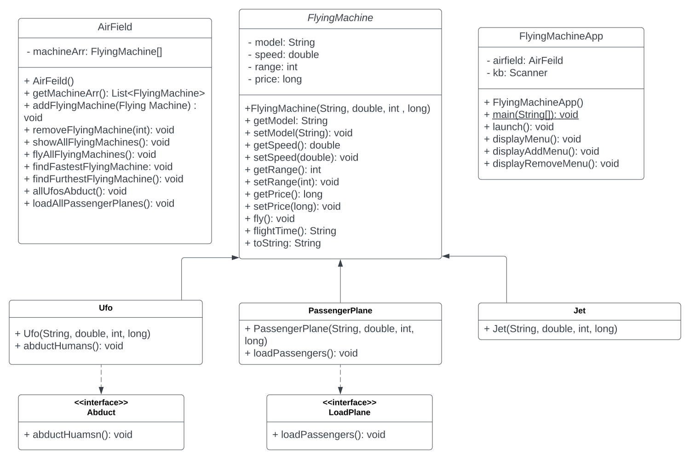

## Jets Project

### Description

This application has a collection of flying machines that are stored
in an air field. Upon startup of the application the air field reads
in flying machines from a .txt file and stores the machines. There are
three types of flying machines, a Ufo, Passenger plane, and Jets. Each
plane type has a model, speed, range, and price. Along with various other
methods such as flying.

The menu is displayed with various options to choose from. These options 
include: 

1. List fleet
	* This displays every flying machine in the air field with all of their stats.  
	
2. Fly all machines
	* This calls the fly() method on every flying machine in the air field,
	displaying each machines stats and time they can fly without running 
	out of fuel. 
	
3. View fastest machine 
	* Displays the stats of the fastest machine
	
4. View machine with longest range
	* Displays the stats of the machine with the longest range.	
	
5. 	All Ufos Abduct!
	* Calls the Interface method of each Ufo machine. This displays the number 
	humans being abducted by each Ufo type. 

6. Board all passenger planes
	* calls the Interface method of each passenger plane. This displays the a flight
	number and number of passengers on the flight.
	
7. Add flying machine from fleet
	* Displays a sub menu where you can choose the type of flying machine to add to 
	the air field. User is then prompted to enter make, speed, range, and price of 
	the flying machine. 
	
8. Remove flying machine from fleet
	* Displays all flying machines in the air field and promts the user for the 
	model they want removed from the air field. Once the make is entered the 
	user is displayed with "Blank_Model" removed. If the user dosen't enter a 
	valid model in the air field, a message is displayed telling the user that 
	"No Machines were removed, invalid choice". 

9. Save Save flying machines to file
	* Asks user to enter the name of the file they want to save the jets as. User
	enters a name and ".txt" is appended to the user input. The file name is then 
	checked to make sure it isn't the same name as the source file. If its not 
	then new file is saved with all flying machines info in the air field. The 
	flying machines info is saved in CSV file format. 
	
10. Quit 
	* stops the program		
	
Each time a menu option is selected the user will be returned to the main menu 
until quit is selected. 	 	

### Technologies used

- Eclipse IDE
- Git
- Java
	* Version: 1.8
	
This program utilizes OOP to create different types of FlyingMachine objects.
It also utilized the use of an abstract class and interfaces to give subclasses
instance fields and different methods. 

### What I learned 

This project really brought my knowledge together on the true beauty of object 
oriented programming. Using abstract classes to easily populate subclasses with
field data and methods makes polymorphism an ease. This made accessing my objects
methods possible after being populated into an ArrayList.

I had ran into an issue adding try catch blocks around my scanners inputs were 
if the exception was thrown it would create an infinite loop. I was trying to 
clear my scanner directly after my nextInt() with a nextLine(). But come to find 
out the nextLine() was never being called since nextInt() immediately throws the 
exception it completely skipped over the nextLine(). Therefore the scanner was 
never getting cleared and being sent into the loop. This was simply resolved by 
adding the nextLine() outside of the try catch block. 

Overall this project me helped get in some practice with using objects and calling
their methods making me feel much better about properly using them in my code. 
This was my first use of an interface I have used on a project, I feel pretty 
comfortable with them and am excited to see how I can make more use of them. 

### UML

